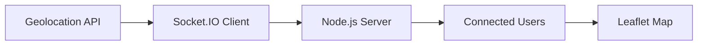

<div align="center">

# 🌍 Tracking You Realtime

### Real-Time Location Tracking with Node.js, Socket.IO & Leaflet

<p>
  
  
  
  
</p>

**📍 Live GPS Tracking • ⚡ Real-Time Updates • 🗺️ Interactive Maps**

</div>

---

## 🚀 Overview

Tracking You Realtime is a web application that allows users to share and track live locations in real time. Built using **Node.js**, **Express.js**, **Socket.IO**, and **Leaflet**, it instantly updates user locations on an interactive map using WebSockets.

---

## ✨ Features

- 📍 Real-time location tracking
- ⚡ Instant updates with Socket.IO
- 🗺️ Interactive map using Leaflet
- 👥 Multi-user location sharing
- ❌ Automatic marker removal on disconnect
- 📱 Responsive and lightweight UI

---

## 🛠️ Tech Stack

**Frontend**
- HTML
- CSS
- JavaScript
- EJS
- Leaflet.js

**Backend**
- Node.js
- Express.js
- Socket.IO

**Services**
- Geolocation API
- OpenStreetMap

---

## ⚙️ Getting Started

```bash
# Clone repository
git clone https://github.com/alokspacy/Tracking_You_Realtime.git

# Navigate into project
cd Tracking_You_Realtime

# Install dependencies
npm install

# Start server
node app.js
```

Open:

```bash
http://localhost:3000
```

Allow location access and start tracking in real time.

---

## 🔄 How It Works



---

## 📸 Preview


---

## 🚀 Future Improvements

- Authentication
- Private Tracking Rooms
- Route History
- Geofencing Alerts
- Cloud Deployment

---

## ⭐ Support

If you like this project, consider giving it a **Star ⭐** on GitHub.

<div align="center">

Built with ❤️ by Alok Singh

</div>
